# Process Flow — POS Order to Demand-Driven Procurement

> Traces the complete path from a customer placing a DialTone order through inventory depletion,
> reorder detection, AI-informed procurement, and stock replenishment.

---

## Flow Diagram

```mermaid
flowchart TD
    A([Customer places order\nvia DialTone phone AI])
    --> B["`**Webhook received**
    HMAC-SHA256 signature verified
    Idempotency check on source_order_id`"]
    --> C{Already\ningested?}

    C -->|Duplicate| DUP([200 OK — no-op])
    C -->|New| D["`**sales_order** + **sales_order_line** rows created
    source_system: dialtone
    status: ingested`"]

    D --> E{All order lines\nmapped to\nmenu items?}

    E -->|Missing mapping| F[/"`Unmapped items → **unmapped_item_queue**
    **insight_alert** raised
    User resolves in UI`"/]

    E -->|All mapped| G["`**BOM Explosion**
    For each order line:
    explode(menu_item, qty_sold)
    → flat map of raw ingredient quantities
    accounting for yield % and waste %`"]

    G --> H["`**inventory_transaction** rows inserted
    txn_type: sale_depletion
    qty_delta: −N per raw ingredient
    ref_type: sales_order`"]

    H --> I["`**stock_level** projections updated
    Supabase Realtime broadcast to web + mobile clients`"]

    H --> J["`**WAC unchanged** on depletion
    Cost recorded at time of last receipt`"]

    I --> K{Any item's
    on_hand_qty ≤
    reorder_point?}

    K -->|No| OK([Stock healthy — no action])

    K -->|Yes| L["`**insight_alert** raised
    type: low_stock
    severity based on how far below reorder point`"]

    L --> M["`Draft **PO line** generated
    qty = par_level − on_hand + safety_stock`"]

    subgraph AI [" AI / ML Layer  ·  runs async on schedule "]
        direction TB
        AI1["`**Demand Forecasting**
        LightGBM + Prophet
        inputs: sales history, day-of-week,
        seasonality, holidays, weather
        output: predicted qty per item per period`"]

        AI2["`**Price-Trend Model**
        time-series on price_history
        + external commodity indices
        output: buy-now vs wait guidance`"]

        AI3["`**Shortage Detection**
        anomaly detection on vendor fill-rate,
        lead times, price spikes
        output: early-warning alerts`"]
    end

    AI1 -->|"suggested par levels\n& order quantities"| M
    AI2 -->|"price guidance"| N
    AI3 -->|"early warnings"| L

    M --> N["`**Buyer reviews dashboard**
    low-stock alerts + AI suggestions
    price guidance + shortage warnings`"]

    N --> O["`**Build shopping list**
    across all flagged items
    multi-vendor sourcing applied`"]

    O --> P["`**Auto-split into per-vendor POs**
    best-value vendor selected
    weighted score: price + reliability + lead time
    sole-source risk flagged`"]

    P --> Q["`Suggested order date calculated:
    today + vendor lead_time_days
    so stock arrives before depletion`"]

    Q --> R{PO value above
    approval
    threshold?}

    R -->|Yes| S["`**Approval workflow**
    PO status: pending_approval
    Manager reviews and approves`"]

    R -->|No| T

    S --> T["`**PO sent to vendor**
    status: sent
    PDF generated server-side
    delivered via Resend email`"]

    T --> U[Vendor fulfils and delivers]

    U --> V["`**Mobile receiving** against PO
    scan / confirm items
    capture quantities + discrepancies
    photograph invoice`"]

    V --> W["`**inventory_transaction** rows inserted
    txn_type: receipt
    qty_delta: +N per item received`"]

    W --> X["`**stock_level** updated
    **WAC recalculated**:
    new_avg = (on_hand × avg_cost + recv_qty × recv_price)
                / (on_hand + recv_qty)`"]

    X --> Y["`**Plate cost recalculated**
    for every menu item that uses
    the received ingredient
    new cost_snapshot written`"]

    X --> Z["`**Vendor reliability score** updated
    on-time %, fill rate, price stability`"]

    Y --> DONE([Cycle complete\nStock replenished · Costs current])
```

---

## Stage Summary

| # | Stage | Key records written | Trigger for next stage |
|---|---|---|---|
| 1 | **Order ingested** | `sales_order`, `sales_order_line` | Mapped menu items found |
| 2 | **BOM explosion** | — (computed in memory) | Raw ingredient quantities resolved |
| 3 | **Depletion** | `inventory_transaction` (sale_depletion) | `stock_level` updated |
| 4 | **Reorder check** | `insight_alert` (low_stock), draft PO line | `on_hand_qty` ≤ `reorder_point` |
| 5 | **AI enrichment** | `forecast`, updated par-level suggestions | Scheduled (async, not blocking the sale path) |
| 6 | **Procurement** | `purchase_order`, `purchase_order_line` | Buyer action (AI suggestions are proposals only) |
| 7 | **Receiving** | `goods_receipt`, `inventory_transaction` (receipt) | PO delivery confirmed on mobile |
| 8 | **Cost update** | `stock_level` (WAC), `cost_snapshot` | Receipt transaction posted |

---

## Key Design Decisions in This Flow

**Idempotency** — the ingestion endpoint keys on `(source_system, source_order_id)`. A replayed DialTone webhook is a no-op; stock is never double-depleted.

**Channel-agnostic ingestion** — `source_system` is a discriminator. Toast, Square, and Clover connectors slot into the same pipeline in a future phase without touching the depletion logic.

**AI as a suggester, never an actor** — the ML layer writes forecasts and raises alerts; it never auto-creates or auto-sends a PO. Every procurement action requires a human to confirm.

**Event-sourced ledger** — `inventory_transaction` is append-only. Current stock is always re-derivable from the ledger. No balance is ever mutated in place.

**Separation of depletion and costing** — WAC does not change on a sale (depletion); it only changes on a receipt. This keeps the cost model stable between receiving events.
